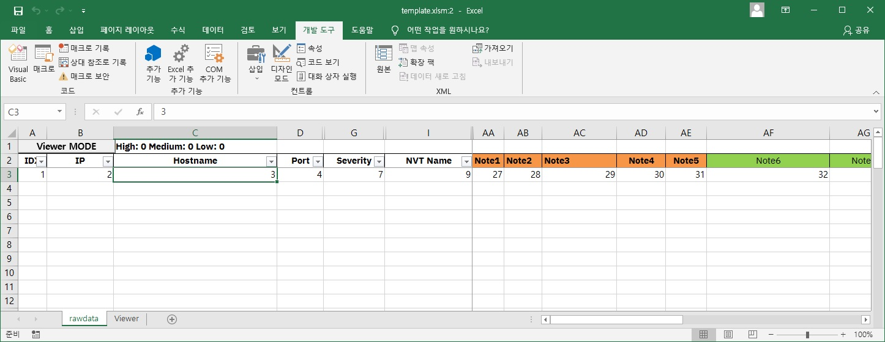
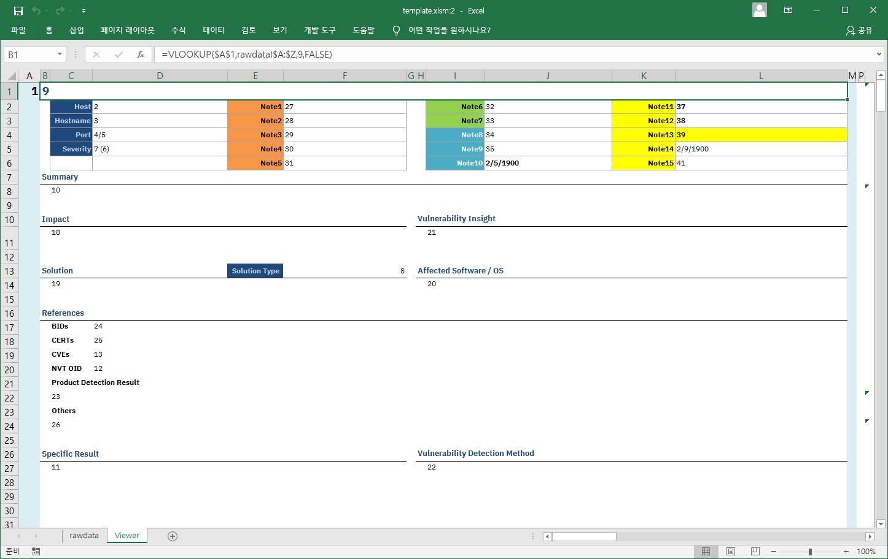
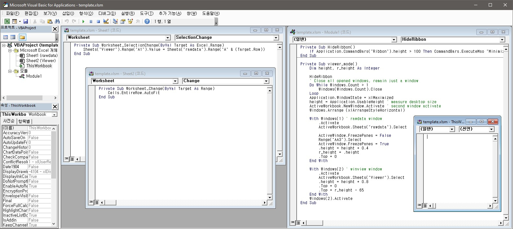

# GVMTool

## Prerequisites
Python Version >= 3.6 (to use f-string)

## Install

```bash
# git clone this repository
cd gvmtool
python setup.py build
python setup.py install
```

## Commands
* merge-report
### merge-report
This command makes CSV files to one excel file and generates a xlsm file based on template.xlsm file.

- CSV files: downloaded results from OpenVAS(GVM)

As you can see, the template file includes 2 sheets. One of them is "rawdata"
and another one is "Viewer".




And this xlsm file includes some VB Macro scripts like below.

* There is no malformed code. VB script was used only to show the data that you selected on rawdata sheet, in viewer sheet.



> You can make your template by updating the template.xlsm file.
> Please refer to the template file located to "\<your_python_lib_dir\>/\<python_version\>/site-packages/gvmtool-\<version\>-py\<version\>.egg/data" if you already installed this tool.

# Execution
```bash
# Help
python -m gvmtool --help

# Merge csv report files
python -m gvmtool merge-report --path <path to csvfiles>
```
