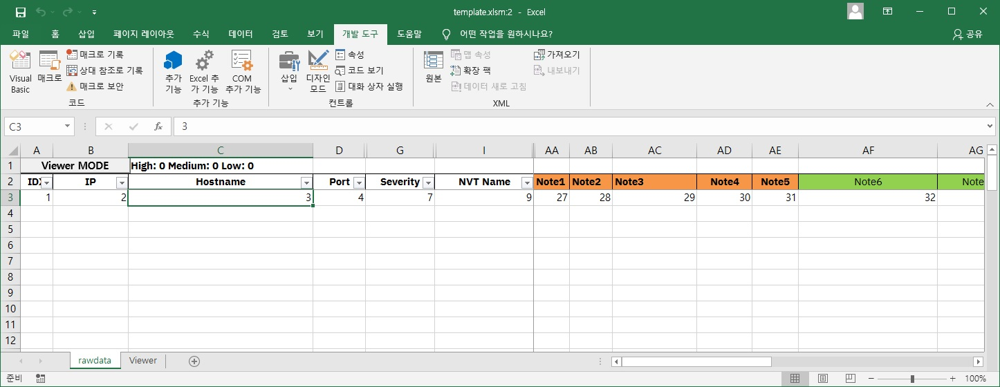
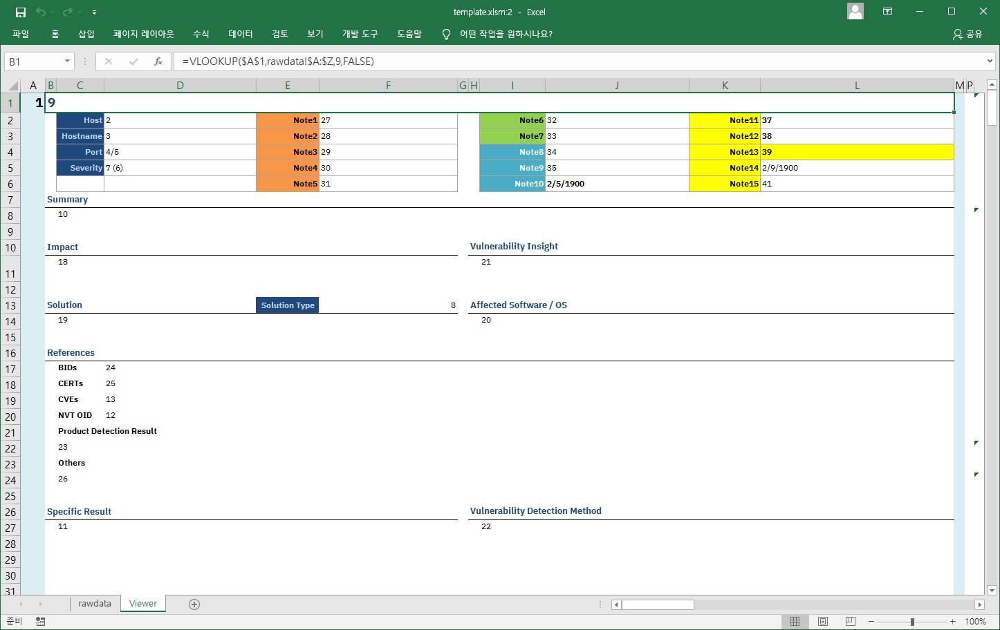
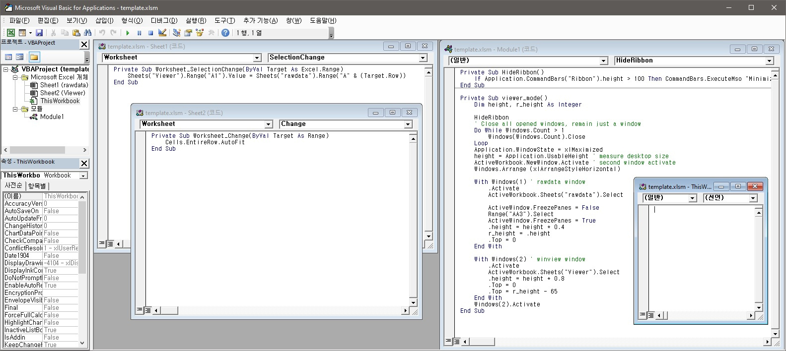

This merges CSV files to a xlsm file from template.xlsm.

- CSV files: downloaded results from OpenVAS(GVM) results

As you can see, the template file includes 2 sheets. One of them is "rawdata"
and another one is "Viewer".

And this xlsm file includes some VB Macro scripts like below.

* There is no malformed code. VB script was used only to show the data that you selected on rawdata sheet, in viewer sheet.

